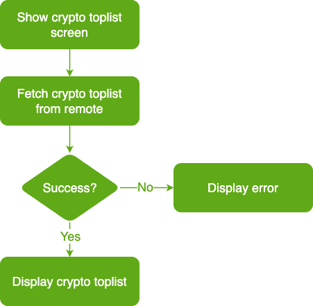

# HighTech Case Study

## Crypto Feature Specs

## BDD Specs

### Story: Customer requests to see crypto toplist in 24 hours

### Narrative #1

```
As an online customer
I want the app to automatically load crypto toplist
So I can always enjoy the newest load crypto toplist
```

#### Scenarios (Acceptance criteria)

```
Given the customer has connectivity
When the customer requests to see crypto toplist
Then the app should display the latest crypto toplist from remote
And replace the cache with the new crypto toplist
```

### Narrative #2

```
As an offline customer
I want the app to show the latest saved version of crypto toplist
So I can always enjoy crypto toplist
```

#### Scenarios (Acceptance criteria)

```
Given the customer doesn't have connectivity
And there’s a cached version of the crypto toplist
And the cache is less than three days old
When the customer requests to see the crypto toplist
Then the app should display the crypto toplist saved

Given the customer doesn't have connectivity
And there’s a cached version of the crypto toplist
And the cache is three days old or more
When the customer requests to see the crypto toplist
Then the app should display an error message

Given the customer doesn't have connectivity
And the cache is empty
When the customer requests to see the crypto toplist
Then the app should display an error message
```

## Use Cases

### Load Crypto Toplist From Remote Use Case

#### Data:
- URL

#### Primary course (happy path):
1. Execute "Load Crypto Toplist" command with above data.
2. System downloads data from the URL.
3. System validates downloaded data.
4. System creates crypto toplist from valid data.
5. System delivers crypto toplist.

#### Invalid data – error course (sad path):
1. System delivers invalid data error.

#### No connectivity – error course (sad path):
1. System delivers connectivity error.

---

### Load Crypto Toplist From Cache Use Case

#### Primary course:
1. Execute "Load Crypto Toplist" command with above data.
2. System retrieves crypto toplist data from cache.
3. System validates cache is less than three days old.
4. System creates crypto toplist from cached data.
5. System delivers crypto toplist.

#### Retrieval error course (sad path):
1. System delivers error.

#### Expired cache course (sad path): 
1. System delivers no feed images.

#### Empty cache course (sad path): 
1. System delivers no feed images.

---

### Validate Feed Cache Use Case

#### Primary course:
1. Execute "Validate Cache" command with above data.
2. System retrieves feed data from cache.
3. System validates cache is less than three days old.

#### Retrieval error course (sad path):
1. System deletes cache.

#### Expired cache course (sad path): 
1. System deletes cache.

---

### Cache Crypto Toplist Use Case

#### Data:
- Crypto Toplist

#### Primary course (happy path):
1. Execute "Save Crypto Toplist" command with above data.
2. System deletes old cache data.
3. System encodes crypto toplist.
4. System timestamps the new cache.
5. System saves new cache data.
6. System delivers success message.

#### Deleting error course (sad path):
1. System delivers error.

#### Saving error course (sad path):
1. System delivers error.

---

## Flowchart


---

## App Architecture
TBD

## Model Specs

### Crypto Toplist

| Property      | Type          |
|---------------|---------------|
| `TBD`         | `TBD`         |
| `TBD` 	| `TBD`    	|

### Payload contract

```
GET /toplist

200 RESPONSE

{
	"items": []
}
```
